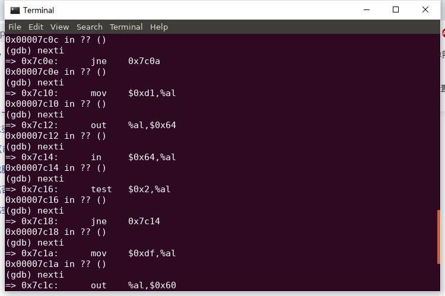
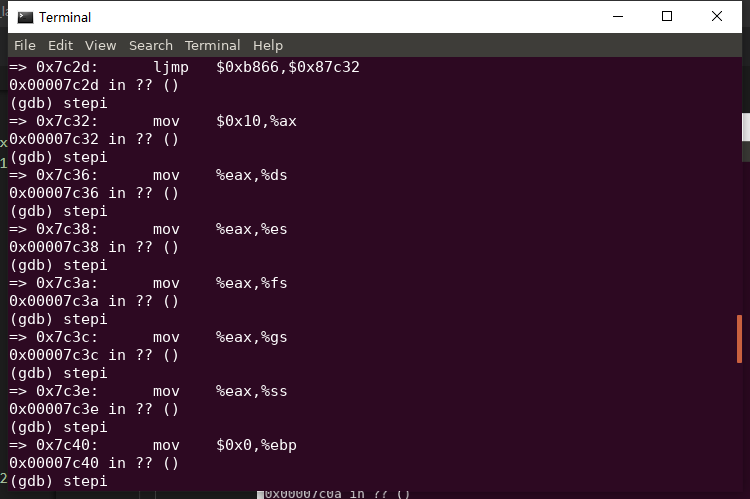
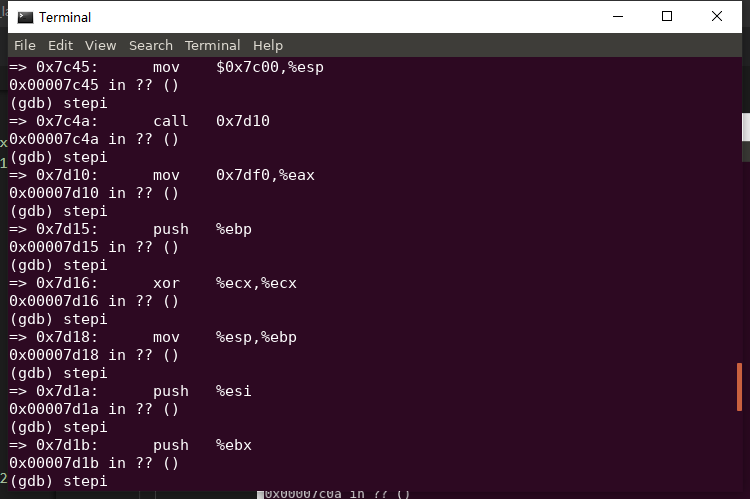
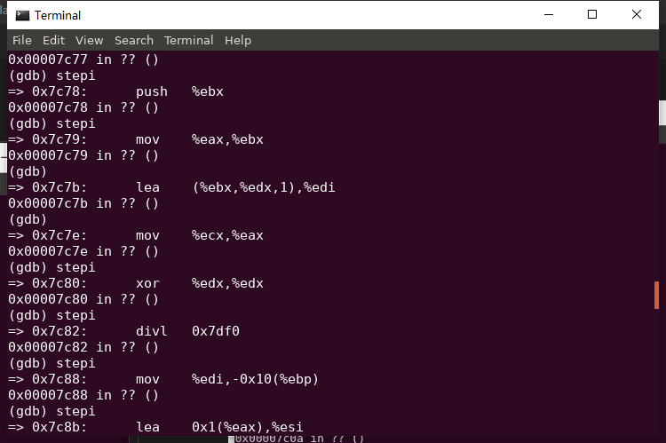
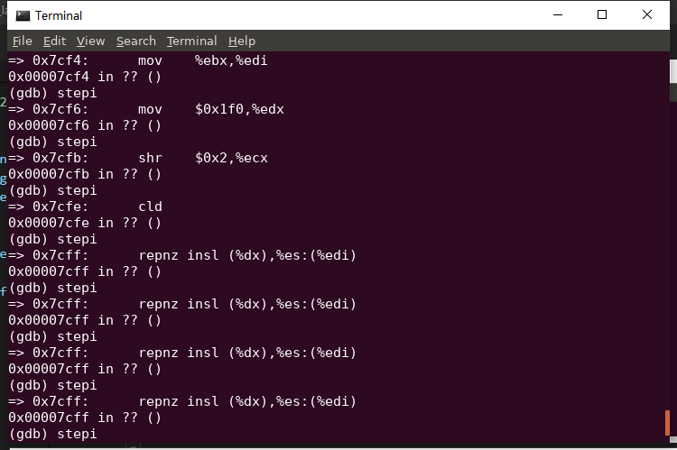
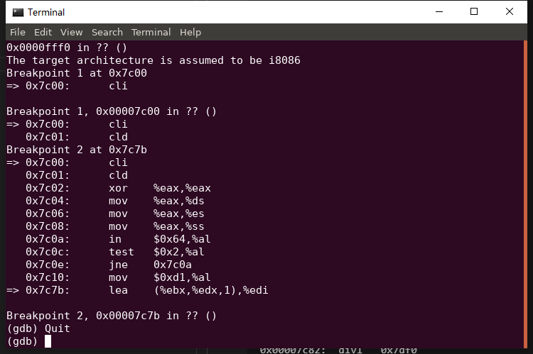
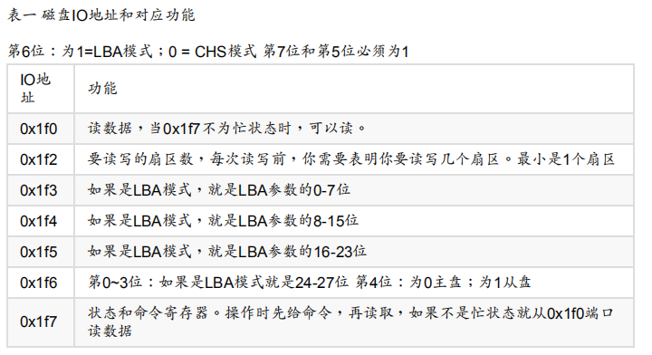

## 练习2及4的相关报告

[**`1811363 洪一帆`**]

[**`1811363 洪一帆`**]:bug_writer

### 练习2 - BIOS的启动及debug

> BIOS实际上是被固化在计算机 ROM（只读存储器）芯片上的一个特殊的软件，为上层软件提供最底层的、最直接的硬件控 制与支持。

1. 断点的设置：
   
   在lab1init中输入：
   ```
   b *0x7c00
   continue
   x /2i $pc
   b *0x00007c7b
   x /10i $pc
   continue
   ```  

   在0x7c00处设置断点。此地址是bootloader入口点地址，即boot/bootasm.S的start地址处。
   0x00007c7b是BootLoader中的一个位置，可以在结果中看到它的上下文。

    [运行结果查看](labcodes_answer/lab1_result/bin/q.log)
    
   
   
   
   
   
   

   


   ```s
   0x00007c00:  cli    
   0x00007c00:  cli    
   0x00007c01:  cld    
   0x00007c02:  xor    %ax,%ax
   0x00007c04:  mov    %ax,%ds
   0x00007c06:  mov    %ax,%es
   0x00007c08:  mov    %ax,%ss
   0x00007c0a:  in     $0x64,%al
   0x00007c0c:  test   $0x2,%al
   0x00007c0e:  jne    0x7c0a
   0x00007c10:  mov    $0xd1,%al
   0x00007c12:  out    %al,$0x64
   0x00007c14:  in     $0x64,%al
   0x00007c16:  test   $0x2,%al
   0x00007c18:  jne    0x7c14
   0x00007c1a:  mov    $0xdf,%al
   0x00007c1c:  out    %al,$0x60
   0x00007c1e:  lgdtw  0x7c6c
   0x00007c23:  mov    %cr0,%eax
   0x00007c26:  or     $0x1,%eax
   0x00007c2a:  mov    %eax,%cr0
   0x00007c2d:  ljmp   $0x8,$0x7c32
   0x00007c32:  mov    $0x10,%ax
   0x00007c36:  mov    %eax,%ds
   0x00007c38:  mov    %eax,%es
   0x00007c3a:  mov    %eax,%fs
   0x00007c3c:  mov    %eax,%gs
   0x00007c3e:  mov    %eax,%ss
   0x00007c40:  mov    $0x0,%ebp
   0x00007c45:  mov    $0x7c00,%esp
   0x00007c4a:  call   0x7d10
   0x00007d10:  mov    0x7df0,%eax
   0x00007d15:  push   %ebp
   0x00007d16:  xor    %ecx,%ecx
   0x00007d18:  mov    %esp,%ebp
   0x00007d1a:  push   %esi
   0x00007d1b:  push   %ebx
   0x00007d1c:  lea    0x0(,%eax,8),%edx
   0x00007d23:  mov    0x7dec,%eax
   0x00007d28:  call   0x7c72
   0x00007c72:  push   %ebp
   0x00007c73:  mov    %esp,%ebp
   0x00007c75:  push   %edi
   0x00007c76:  push   %esi
   0x00007c77:  push   %ebx
   0x00007c78:  push   %ebx
   0x00007c79:  mov    %eax,%ebx
   0x00007c7b:  lea    (%ebx,%edx,1),%edi
   0x00007c7e:  mov    %ecx,%eax
   0x00007c80:  xor    %edx,%edx
   0x00007c82:  divl   0x7df0
   0x00007c88:  mov    %edi,-0x10(%ebp)
   0x00007c8b:  lea    0x1(%eax),%esi
   0x00007c8e:  sub    %edx,%ebx
   0x00007c90:  cmp    -0x10(%ebp),%ebx
   0x00007c93:  jae    0x7d0a
   0x00007c95:  mov    $0x1f7,%edx
   0x00007c9a:  in     (%dx),%al
   0x00007c9b:  and    $0xffffffc0,%eax
   0x00007c9e:  cmp    $0x40,%al
   0x00007ca0:  jne    0x7c95
   0x00007ca2:  mov    $0x1f2,%edx
   0x00007ca7:  mov    $0x1,%al
   0x00007ca9:  out    %al,(%dx)
   0x00007caa:  mov    $0x1f3,%edx
   0x00007caf:  mov    %esi,%eax
   0x00007cb1:  out    %al,(%dx)
   0x00007cb2:  mov    %esi,%eax
   0x00007cb4:  mov    $0x1f4,%edx
   0x00007cb9:  shr    $0x8,%eax
   0x00007cbc:  out    %al,(%dx)
   0x00007cbd:  mov    %esi,%eax
   0x00007cbf:  mov    $0x1f5,%edx
   0x00007cc4:  shr    $0x10,%eax
   0x00007cc7:  out    %al,(%dx)
   0x00007cc8:  mov    %esi,%eax
   0x00007cca:  mov    $0x1f6,%edx
   0x00007ccf:  shr    $0x18,%eax
   0x00007cd2:  and    $0xf,%eax
   0x00007cd5:  or     $0xffffffe0,%eax
   0x00007cd8:  out    %al,(%dx)
   0x00007cd9:  mov    $0x20,%al
   0x00007cdb:  mov    $0x1f7,%edx
   0x00007ce0:  out    %al,(%dx)
   0x00007ce1:  mov    $0x1f7,%edx
   0x00007ce6:  in     (%dx),%al
   0x00007ce7:  and    $0xffffffc0,%eax
   0x00007cea:  cmp    $0x40,%al
   0x00007cec:  jne    0x7ce1
   0x00007cee:  mov    0x7df0,%ecx
   0x00007cf4:  mov    %ebx,%edi
   0x00007cf6:  mov    $0x1f0,%edx
   0x00007cfb:  shr    $0x2,%ecx
   0x00007cfe:  cld    
   0x00007cff:  repnz insl (%dx),%es:(%edi)
   0x00007cff:  repnz insl (%dx),%es:(%edi)
   0x00007cff:  repnz insl (%dx),%es:(%edi)
   0x00007cff:  repnz insl (%dx),%es:(%edi)
   0x00007cff:  repnz insl (%dx),%es:(%edi)
   ```

   其与bootasm.S和bootblock.asm中的代码不完全相同。

 对于下列定义，反编译后直接用初始值代替符号，但是有些值会变化，比如`PROT_MODE_CSEG`
 ```s
 .set PROT_MODE_CSEG,        0x8     # kernel code segment selector
 .set PROT_MODE_DSEG,        0x10    # kernel data segment selector
 .set CR0_PE_ON,             0x1     # protected mode enable flag
 ```

2. BIOS 的启动和作用
   
   一开电，启动的是实模式，早期是为了向下兼容。
   
   CS为F000H，它的shadow register的Base值初始化设置为0xFFFF0000
   
   EIP（即offset）指向FFF0H。
   
   将地址相加，得到BIOS的起始地址FFFF FFF0H。

   这个长跳转指令会触发更新CS寄存器和它的shadow register，即执行`jmp F000 : E05B`后，CS将被更新成0xF000。表面上看CS其实没有变化， 但CS的shadow register被更新为另外一个值了，它的Base域被更新成0x000F0000，此时形 成的物理地址为Base+EIP=0x000FE05B，这就是CPU执行的第二条指令的地址。

- **理论结合实践**
   
   可以从log中看到起始地址确实为FFFF FFF0H，并且执行了一个长跳转。
   
   ```s  
   IN: 
   0xfffffff0:  ljmp   $0xf000,$0xe05b
      ```
   
   然后BIOS加载存储设备（比如硬盘）上的第一个扇区内容（512byte）到0x7c00，启动BootLoader。（为了减小难度BIOS只加载一个扇区，靠BootLoader来加载ucore。）
   

### 练习4 - 分析bootloader加载ELF格式的OS的过程。

#### 作用

- 从实模式启动保护模式(16位寻址空间变成32位）（练习3中介绍）

- 段机制（但是段机制和后面的页机制功能重复，所以后来主要采用页机制来实现分块的功能）。
   
- 构建GDT全局描述符表，用来记录各个段起始地址和长度

- 读磁盘中ELF执行文件格式的ucore操作系统到内存。

- 显示字符串信息

- 结束后把控制权交给ucore操作系统

#### ucore的启动

**ELF header描述了整个文件的组织。**

  ```c++
   /* file header */
   struct elfhdr {
      uint32_t e_magic;     // must equal ELF_MAGIC
      uint8_t e_elf[12];
      uint16_t e_type;      // 1=relocatable, 2=executable, 3=shared object, 4=core image
      uint16_t e_machine;   // 3=x86, 4=68K, etc.
      uint32_t e_version;   // file version, always 1
      uint32_t e_entry;     // entry point if executable
      uint32_t e_phoff;     // file position of program header or 0
      uint32_t e_shoff;     // file position of section header or 0
      uint32_t e_flags;     // architecture-specific flags, usually 0
      uint16_t e_ehsize;    // size of this elf header
      /*给出其自身程序头部的大小*/
      uint16_t e_phentsize; // size of an entry in program header
      uint16_t e_phnum;     // number of entries in program header or 0
      uint16_t e_shentsize; // size of an entry in section header
      uint16_t e_shnum;     // number of entries in section header or 0
      uint16_t e_shstrndx;  // section number that contains section name strings
   };

   /* program section header */
   struct proghdr {
      uint32_t p_type;   // loadable code or data, dynamic linking info,etc.
      uint32_t p_offset; // file offset of segment
      uint32_t p_va;     // virtual address to map segment
      uint32_t p_pa;     // physical address, not used
      uint32_t p_filesz; // size of segment in file
      uint32_t p_memsz;  // size of segment in memory (bigger if contains bss）
      uint32_t p_flags;  // read/write/execute bits
      uint32_t p_align;  // required alignment, invariably hardware page size
   };
```

**磁盘的访问以加载ucore核心代码**

考虑到实现的简单性，bootloader的访问硬盘都是 [`LBA模式`] 的PIO（Program IO）方式，即所有的IO操作 是通过CPU访问硬盘的IO地址寄存器完成。

[`LBA模式`]:LBA(LogicalBlockAddressing)逻辑块寻址模式。管理的硬盘空间可达8.4GB。在LBA模式下，设置的柱面、磁头、扇区等参数并不是实际硬盘的物理参数。在访问硬盘时，由IDE控制器把由柱面、磁头、扇区等参数确定的逻辑地址转换为实际硬盘的物理地址。在LBA模式下，可设置的最大磁头数为255，其余参数与普通模式相同，由此可以计算出可访问的硬盘容量为：512x63x255x1025=8.4GB。不过现在新主板的BIOS对INT13进行了扩展，使得LBA能支持100GB以上的硬盘。



- readsect():
   - 等待磁盘准备好
    `waitdist()`

   - 通过寄存器设置读取的一些参数
   ```c++
      outb(0x1F2, 1);                         // count = 1
      outb(0x1F3, secno & 0xFF);
      outb(0x1F4, (secno >> 8) & 0xFF);
      outb(0x1F5, (secno >> 16) & 0xFF);
      outb(0x1F6, ((secno >> 24) & 0xF) | 0xE0);
      outb(0x1F7, 0x20);                      // cmd 0x20 - read sectors
   ```
   - 等待磁盘准备好`waitdist()`
   - 把磁盘扇区数据读到指定内存 
   ```c++
      // read a sector
      insl(0x1F0, dst, SECTSIZE / 4);
   ```
- bootmain():
  - steps：
    - 加载os elf文件，检查其合法性
    - 构建基础数据结构（proghdr、elfhdr）存储os相关属性
    - 成功读取elf，则将控制权交给os
    - 否则异常处理且不退出，一直由BootLoader接管
  
  - codes:
   ```c++
         /* bootmain - the entry of bootloader */
   void
   bootmain(void) {
      // read the 1st page off disk
      //读取elf header
      readseg((uintptr_t)ELFHDR, SECTSIZE * 8, 0);

      // is this a valid ELF?
      if (ELFHDR->e_magic != ELF_MAGIC) {
         goto bad;
      }

      struct proghdr *ph, *eph;

      // load each program segment (ignores ph flags)
      ph = (struct proghdr *)((uintptr_t)ELFHDR + ELFHDR->e_phoff);
      eph = ph + ELFHDR->e_phnum;
      for (; ph < eph; ph ++) {
         readseg(ph->p_va & 0xFFFFFF, ph->p_memsz, ph->p_offset);
      }

      // call the entry point from the ELF header
      // note: does not return
      ((void (*)(void))(ELFHDR->e_entry & 0xFFFFFF))();

   bad:
      outw(0x8A00, 0x8A00);
      outw(0x8A00, 0x8E00);

      /* do nothing */
      while (1);
   }
   ```
   